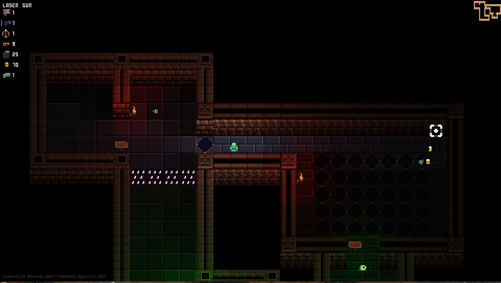
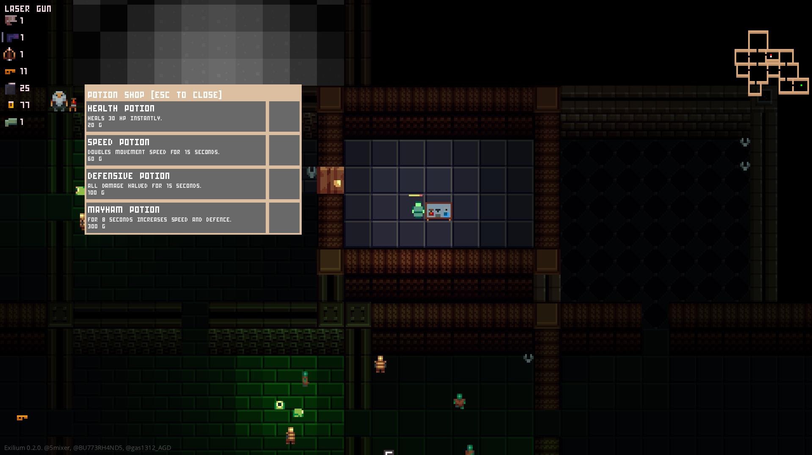

# Dungeon Game 'Exilium'
A game made over the summer holidays with Haxe and Kha. Fantastic experience collaborating with talented people across the world (Italy, Mexico, Australia!) and building a game with a large number of interconnecting systems.

Playable [here](https://5mixer.itch.io/exilium).

Made in collaboration with the brilliant musician [Gas1312](https://gas1312.bandcamp.com/album/exilium-ost) and pixel artist [Patch](https://github.com/Patch83).

[Sound Track on Bandcamp](https://gas1312.bandcamp.com/album/exilium-ost)

## Features

 - Cross platform thanks to Haxe and Kha
 - Procedurally generated levels that are different every time
 - Lovely pixel art thanks to Patch and very catchy music thanks to Gas.
 - A wide array of collectable items
   - Health potions, speed potions
   - Laser guns, pistols, shot guns, bow and arrows
   - Bombs that explode physically, launching other entities and bombs away
- Keys and locked doors
- Start of level shop
- End of game boss
- Goblins, slimes, and an array of other spooky dungeon enemies.

## Technical Details
 - Uses Kha for cross-platform rendering, input, sound.
 - Entity Control System architecture through the Eskimo library.
 - Narrow phase Separation Axis Theorem based collisions through the Differ library.
 - Realtime lighting through simple sprite colouring. Lights with shadows through simple grid raycasting.
 - Audio blending for smooth level music track changes using Actuate tweens
 - Engine also implements:
    - Animation processing
    - AI Finite State Machines
    - UI debug overlay with ZUI

## Screenshots

